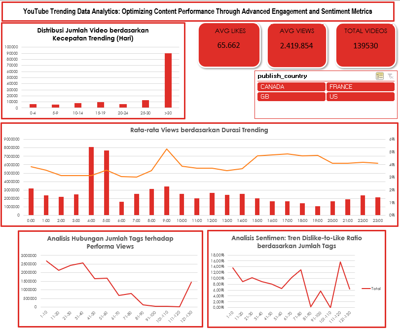

# YouTube Trending Data Analytics: Optimizing Content Performance Through Advanced Engagement and Sentiment Metrics

## 📌 Project Overview
This project focuses on transforming a messy, large-scale raw dataset containing over 130,000 global YouTube trending video records into an interactive, insight-driven **Executive Dashboard**. By utilizing advanced data cleaning, engineering custom business metrics, and structural data modeling in Microsoft Excel, this analysis uncovers critical drivers behind video virality and audience behaviors.

---

## 📊 Interactive Dashboard Preview
Below is the final executive dashboard designed to assist content creators and digital strategists in making data-driven decisions:

---

## 💡 Key Business Insights Uncovered

* **Optimal Release Window:** While the highest gross volume of views is dominated by videos published during early dawn hours (04:00 - 05:00), the most stable and high-quality audience interaction (**Engagement Rate**) consistently occurs during the evening prime time window (**15:00 - 19:00**).
* **The "Tag-Spamming" Sentiment Trap:** Data shows a clear linear penalty for keyword stuffing. Content utilizing an excessive number of tags (clusters >110 tags) experiences a sharp drop in viewership while simultaneously triggering a spike in the **Dislike-to-Like Ratio**, indicating that audiences perceive the content as clickbait or spam.
* **Velocity Metrics:** Over 80,000 videos achieve trending status rapidly within the first 0-4 days post-release, proving that initial momentum and early engagement triggers are highly critical to the YouTube recommendation algorithm.

---

## 🛠️ Data Preparation & Architecture (What I Did)

### 1. Data Cleaning & Standardization
* Cleaned and standardized large numerical values across 130K+ rows of data to resolve structural inconsistencies.
* Resolved multi-regional data structures and eliminated null/blank values within critical metrics fields.

### 2. Metrics Engineering
* **Time-Frame Simplification:** Extracted and simplified overlapping timestamp strings into a clean 24-hour categorical dimension (`00:00` - `23:00`) to significantly enhance chart scannability.
* **Engagement Rate (ER):** Formulated an aggregate interaction ratio to map out deep audience engagement beyond raw views.
* **Dislike-to-Like Ratio:** Built an error-handled sentiment metric utilizing `IFERROR` functions to mathematically track and mitigate negative community sentiment.

### 3. Dashboard Architecture
* Constructed dynamic **Pivot Tables** and **Pivot Charts** to anchor visual components.
* Configured a centralized **Slicer Network** via *Report Connections* to allow cross-functional filtering by geographical region (`publish_country`), enabling stakeholders to toggle data perspectives instantly.

---

## 📁 Repository Structure
* `YouTube_Trending_Data_Analytics.xlsx` : The primary Excel working file containing the raw data sheet, analytical processing sandbox, and the final interactive dashboard.
* `dashboard.png` : High-definition export of the visual interface for quick previewing.

---
*Developed as part of my Data Analytics Portfolio.*
